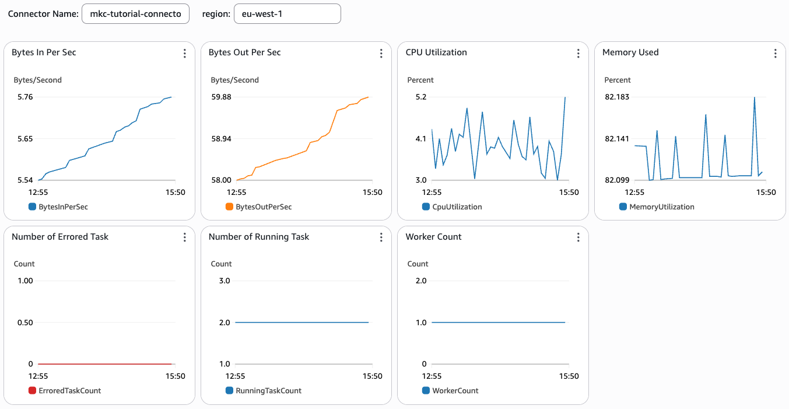
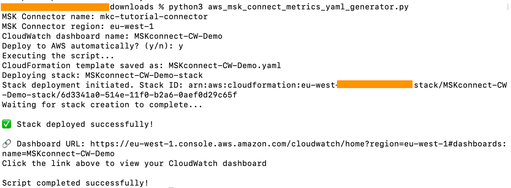
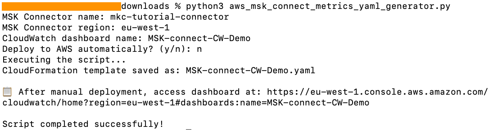

# Managed Service for Apache Kafka Connect (MSK Connect) CloudWatch Metrics Dashboard

When running Amazon MSK Connect, there are questions which should be addressed:

* What should be monitored? 
* What are thresholds to alert or other action(s)?

This repo provides a custom CloudWatch dashboard to answer these questions.  It is based on the AWS documentation on [MSK Connect monitoring](https://docs.aws.amazon.com/msk/latest/developerguide/mkc-monitoring-overview.html)

Screenshot of the MSK Connect CloudWatch dashboard:
 
 

## Requirements

Using this MSK Connect Cloudwatch dashboard assumes you have a MSK cluster, connector deployed with MSK connect. 

Prerequistes on your local machine:
-  Python, pip, pyyaml, boto3, JSON libraries
-  AWS CLI to automatically deploy CloudWatch Metrics dashboard

## Quickstart

1. Download aws_msk_connect_metrics_yaml_generator.py from this repo and save it in your local directory.

2. Execute aws_msk_connect_metrics_yaml_generator.py on your local machine and respond to following prompts to provide inputs.

-   MSK Connector name: Connector name
-   MSK Connector region: Connector region
-   CloudWatch dashboard name: Name of the CloudWatch dashboard (avoid using underscores)
-   Deploy to AWS automatically? (y/n): Choose "y" if you prefer to deploy the CloudWatch Metrics dashboard automatically.

-   Deploy to AWS automatically? (y/n): Choose "n" if you prefer to deploy the CloudWatch Metrics dashboard manually

## Advanced

You can also configure CloudWatch alarms when the metric breaches the threshold for a specified number of evaluation periods. 

Refer to this [AWS documentation](https://docs.aws.amazon.com/AmazonCloudWatch/latest/monitoring/ConsoleAlarms.html) to configure alarms.

## Future Roadmap

* Unified CloudWatch metrics dashboard view for multiple connectors

## Additional Information

Amazon MSK Connect integrates with Amazon CloudWatch so that you can collect, view, and analyze CloudWatch metrics for Amazon MSK Connect instance. The metrics that you configure for MSK Connect are automatically collected and pushed to CloudWatch.

It is a best practice to continuously monitor your MSK Connect instance for instance health and scalability. You can create metrics monitoring dashboard for Amazon MSK Connect using the CloudWatch console by choosing specific metrics that you would like to monitor. 
